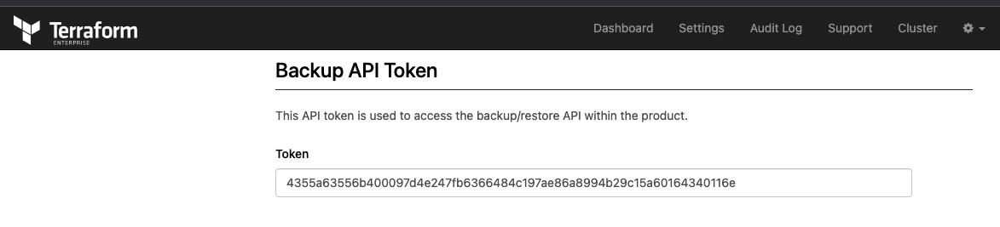

# tfe_backup_restore_api

This repository describes how to do a backup and restore from your TFE environment using the backup and restore API. The repository steps are mainly based on the following official documentation found [here](https://www.terraform.io/enterprise/admin/infrastructure/backup-restore)

### Steps involved are:

### Creating the Terraform Environment
- Create S3 buckets used for TFE
- Upload the necessary software/files for the TFE installation to an S3 bucket
- Generate TLS certificates with Let's Encrypt to be used by TFE
- Create a VPC network with subnets, security groups, internet gateway
- Create a RDS PostgreSQL to be used by TFE
- create roles/profiles for the TFE instance to access S3 buckets
- Create a EC2 instance on which the TFE online installation will be performed

### Backup and Restore API
- You will backup the TFE environment
- Rebuild the EC2 instance, S3 bucket and RDS PostgreSQL instance
- Restore the the TFE environment from backup


# Diagram

  

# Prerequisites

## License
Make sure you have a TFE license available for use

Store this under the directory `files/license.rli`

## AWS
We will be using AWS. Make sure you have the following
- AWS account  
- Install AWS cli [See documentation](https://docs.aws.amazon.com/cli/latest/userguide/install-cliv2.html)

## Install terraform  
See the following documentation [How to install Terraform](https://learn.hashicorp.com/tutorials/terraform/install-cli)

## TLS certificate
You need to have valid TLS certificates that can be used with the DNS name you will be using to contact the TFE instance.  
  
The repo assumes you have no certificates and want to create them using Let's Encrypt and that your DNS domain is managed under AWS. 


# How to

- Clone the repository to your local machine
```
git clone https://github.com/munnep/tfe_backup_restore_api.git
```
- Go to the directory
```
cd tfe_backup_restore_api
```
- Set your AWS credentials
```
export AWS_ACCESS_KEY_ID=
export AWS_SECRET_ACCESS_KEY=
export AWS_SESSION_TOKEN=
```
- Store the files needed for the TFE online installation under the `./files` directory, See the notes [here](./files/README.md)
- create a file called `variables.auto.tfvars` with the following contents and your own values
```
tag_prefix               = "patrick-tfe"                        # TAG prefix for names to easily find your AWS resources
region                   = "eu-north-1"                         # Region to create the environment
vpc_cidr                 = "10.234.0.0/16"                      # subnet mask that can be used 
ami                      = "ami-09f0506c9ef0fb473"              # AMI of the Ubuntu image  
rds_password             = "Password#1"                         # password used for the RDS environment
filename_license         = "license.rli"                        # filename of your TFE license stored under ./files
dns_hostname             = "patrick-tfe3"                       # DNS hostname for the TFE
dns_zonename             = "bg.hashicorp-success.com"           # DNS zone name to be used
tfe_password             = "Password#1"                         # TFE password for the dashboard and encryption of the data
certificate_email        = "patrick.munne@hashicorp.com"        # Your email address used by TLS certificate registration
public_key               = "ssh-rsa AAAAB3Nz"                   # The public key for you to connect to the server over SSH
```
- Terraform initialize
```
terraform init
```
- Terraform plan
```
terraform plan
```
- Terraform apply
```
terraform apply
```
- Terraform output should create 33 resources and show you the public dns string you can use to connect to the TFE instance
```
Apply complete! Resources: 33 added, 0 changed, 0 destroyed.

Outputs:

ssh_tfe_server = "ssh ubuntu@patrick-tfe3.bg.hashicorp-success.com"
ssh_tfe_server_ip = "ssh ubuntu@13.51.23.34"
tfe_appplication = "https://patrick-tfe3.bg.hashicorp-success.com"
tfe_dashboard = "https://patrick-tfe3.bg.hashicorp-success.com:8800"
```
- Connect to the TFE dashboard (default password: Password#1). This could take 10 minutes before fully functioning
- Click on the open button to create your organization, workspaces users everything you like and that you can check after a restore. 
- Get the Backup API token from the Terraform Enterprise dashboard under settings   
    
```
4355a63556b400097d4e247fb6366484c197ae86a8994b29c15a60164340116e
```
- create a payload with an encryption password for the file. See `payload.json` for an example
```
{
    "password": "Vewyrubskjdf@#$890werjsdFSFDSdf"
}
```
- create a backup as follow. Change the URL to your own TFE environment

```
export TOKEN=4355a63556b400097d4e247fb6366484c197ae86a8994b29c15a60164340116e
curl \
  --header "Authorization: Bearer $TOKEN" \
  --request POST \
  --data @payload.json \
  --output backup.blob \
  https://patrick-tfe9.bg.hashicorp-success.com/_backup/api/v1/backup
```
output: you don't get any output from the above command. Just a return to your prompt
```
```
- you should now have a `backup.blob` file. This should be used to restore to a different TFE environment
- Destroy the current TFE environment. EC2 instance, db instance, disks, S3 bucket
```
terraform apply -replace aws_ebs_volume.tfe_docker -replace aws_ebs_volume.tfe_swap -replace aws_instance.tfe_server -replace aws_s3_bucket.tfe-bucket -replace aws_db_instance.default
```
- Wait until you can login into the Dashboard and everything is ready
- Do not create an organization or anything within TFE itself
- Get the **new** Backup API token from the Terraform Enterprise dashboard under settings
```
4355a63556b400097d4e247fb6366484c197ae86a8994b29c15a60164340116e
```
- Make sure you have a `payload.json` with the encryption password of the `backup.blob` file
```
{
    "password": "Vewyrubskjdf@#$890werjsdFSFDSdf"
}
```
- restore the backup into your new TFE environment
```
export TOKEN=4355a63556b400097d4e247fb6366484c197ae86a8994b29c15a60164340116e
curl \
  --header "Authorization: Bearer $TOKEN" \
  --request POST \
  --form config=@payload.json \
  --form snapshot=@backup.blob \
  https://patrick-tfe9.bg.hashicorp-success.com/_backup/api/v1/restore
```
output:
```
snapshot applied successfully
```
- You should restart the TFE application before you can continue
- ssh into your server and do the following
```
sudo replicatedctl app stop
sudo replicatedctl app status
sudo replicatedctl app start
```
- you should now be able to login and see your data and things you created earlier


